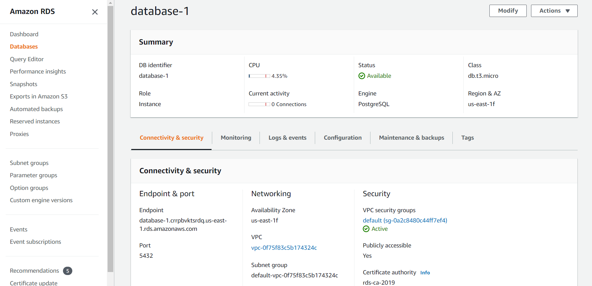
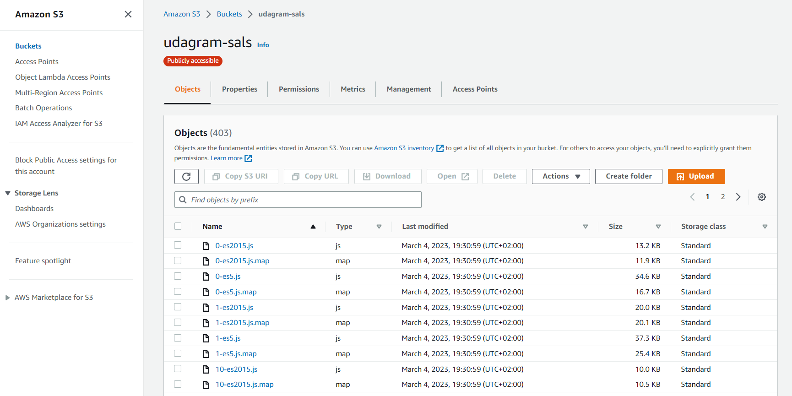

# 📃 Infrastructure description

### The Udagram application is hosted on the Amazon Web Services Cloud using the following services:

#### AWS Relational Database Service (RDS):

#### AWS Elastic Beanstalk (EB):image.png

- EB health: OK

  

#### AWS Simple Storage Service (S3):

- S3 bucket:

  